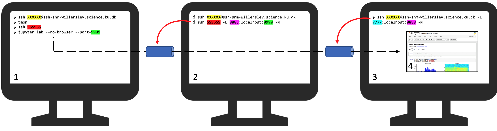

# Jupyter Notebook on Willerslev servers

###### Moisès Coll Macià - 20/01/21

## Contents

1. [Step by step pipeline](#stepbystep)
    - 1.1. Running jupyter notebook on C1
    - 1.2. Open the first ssh tunnel on C2
    - 1.3. Open the first ssh tunnel on C2
    - 1.4. Jupyter notebook in your local machine browser
2. [Caveats and considerations](#caveats)
    - 2.1. Port uniqueness
    - 2.2. Close shh tunnels
    - 2.3. ssh termination
3. [Script](#script)
    - 3.1. Script potential issues and important details
4. [Acknowledgements](#ackn)

In this tutorial I'm going to explain the solution I found to run jupyter notebook in the Willerslev servers remotely from a personal computer. I'm mainly based on [this](https://medium.com/@sankarshan7/how-to-run-jupyter-notebook-in-server-which-is-at-multi-hop-distance-a02bc8e78314) blog post which explains a similar problem. The different steps are shown in **Figure 1** and explained below. The idea is to create an *ssh tunnel* from a computing node (C1), where your jupyther notebook will be running, to the front-end (C2) of Willerslev servers (Step 1 and 2) and another tunnel from the front-end in Willerslev servers to your working station (C3) to open jupyter notebook in your computer browser (Step 3 and Step 4). I assume you've already installed jupyter notebook and all it's dependences and you know how to login to the Willerslev servers. 

Finally, I provide a bash script which automates the whole process. 

Notation summary:

- Computer (C):
    - C1 -> Computing node in one of the Willerslev servers. In Figure 1 denoted as `SSSSSS`
    - C2 -> Fron-end computer in Willerslev servers.
    - C3 -> Your local machine.
- Ports (P):
    - P1 -> C1's port. Here denoted as `9999`.
    - P2 -> C2's port. Here denoted as `8888`.
    - P3 -> C3's port. Here denoted as `7777`.
    
It's important to notice that P must be 1024 >= P <= 65535. More info about ports can be found [here](https://www.ssh.com/ssh/port) and [here](https://linuxhint.com/change_default_ssh_port/).



**Figure 1.** Schematic representation to run Jupyter Notebook in Willerslev servers. Highlighted are:
- Yellow : KU username
- Red : C1
- Green : P1
- Purple : P2
- Cyan : P3

<a name="stepbystep"></a>
## 1. Step by step pipeline

### 1.1. Running jupyter notebook on C1

- Log into the Willerslev servers (on Figure 1.1, you should replace the Xs highlighted in yellow for your user).
- Check which computing node you want to run jupyter notebook on, by running `tmon` for example.
- Log into C1
- Run jupyter notebook in `--no-browser` mode. You must also specify P1, which must be unique to your connection (so be creative :) ), otherwise it gives problems. 


```bash
ssh XXXXXX@ssh-snm-willerslev.science.ku.dk
tmon
ssh SSSSSS
jupyter lab --no-browser --port=9999
```

### 1.2. Open the first ssh tunnel on C2

- On a new terminal, log into the Willerslev servers (on Figure 1.2, you should replace the Xs highlighted in yellow for your user).
- Create an shh tunnel with the command shown in Figure 1.2. Ss highlighted in red represent the C1's name on which you are running the jupyter notebook. Again, you must decide a new port P2 (on Figure 1.2, represented as 8s highlighted in purple) indicated P1 (on Figure 1.2, represented as 9s highlighted in green).


```bash
ssh XXXXXX@ssh-snm-willerslev.science.ku.dk
ssh SSSSSS -L 8888:localhost:9999 -N
```

### 1.3. Open the second ssh tunnel on C3

- On a new terminal (C3), create another shh tunnel with the command shown in Figure 1.3. Xs highlighted in yellow represent your user to connect to Willerslev servers. Again, you must decide a new port P3 (on Figure 1.3, represented as 7s highlighted in cyan) and indicate P2 (on Figure 1.3, represented as 8s highlighted in purple)


```bash
ssh XXXXXX@ssh-snm-willerslev.science.ku.dk -L 7777:localhost:8888 -N
```

### 1.4. Jupyter notebook in your local machine browser

- Open your favourite browser and type `localhost:7777`
- TADAAAA!

<a name="caveats"></a>
## 2. Caveats and considerations

### 2.1. Port uniqueness

While P1, P2 and P3 can be the same number (1024 >= P <= 65535), if there are multiple users using the same ports in the same "computer" it's going to create some conflicts and errors. 

### 2.2. Close shh tunnels

Sometimes, when I close the shh tunnels (Cntl+C), the process keeps running on the background, meaning that the port is still in use. Then, if I try to open again the tunnels, I get the error that... Surprise! the port is on use. To solve that, I kill the process that it's running that particular port with the following command


```bash
for job in `ps aux | egrep 9999 | egrep "ssh" | egrep XXXXXX | awk '{print $2}'`; do kill -9 ${job}; done
```

This selects from all processes running, the ones that have the "9999" (port-id), "ssh" and "XXXXXX" (username) and kill them. 

### 2.3. ssh termination

Sometimes, when the ssh doesn't receive orders, it automatically closes down. This kills the ssh tunnel. To prevent that, I first run `screen` so that even when my session is killed, the process goes on and it does not stop my jupyter notebook while working. 

Let me know if you find more problems while using these to run jupyter notebook that are not reported here and if you have improvements and suggestions!

<a name="script"></a>
## 3. Automating script

I wrote the [kuju.sh](kuju.sh) (yes... not feeling creative to give it a better name :) ) bash script which automates all 4 steps expained in **Step by step pipeline**. At the begining of the script, you will find variables which will need to be manually configured (e.g. `ku_us` variable is your KU username or the ports `p1`, `p2`, `p3`). After that, the only manual work is to figure out which computing node you want to run jupyter notebook on (e.g., "biceps-snm") and run the following command:

```bash
bash kuju.sh biceps-snm
```

Because the tunnels and the jupyter notebook is running in a tmux session, I also incorporated a way to kill those tmux sessions. You can do that by running the following:

```bash
bash kuju.sh biceps-snm kill
```

It's important that you also indicate the computing node.

### 3.1. Script potential issues and important details

1. I use `tmux` in order to open a terminal from which I can log out both in the Willerslev servers and in my local computer. Make sure you have installed `tmux` in both. I installed `tmux` in my local computer using `brew` as shown in [here](https://linuxize.com/post/getting-started-with-tmux/).

2. The pipeline checks if there is already a tmux session running with the defined name. If there is not, `tmux` returns a warning like `failed to connect to server` or `no server running on /private/tmp/tmux-1349466776/default`. This will be printed in your terminal but is not a sign of things going wrong, it's just me not knowing how to avoid it to be printed on the terminal :) .

3. Try to be creative and change the ports. As I say before, it is important that your port is unique!

4. Make sure you can access the Willerslev servers and it's computing nodes without typing your password manually. If you want to generate your ssh key, check this [link](https://www.ssh.com/ssh/keygen/). In my case, the pipeline was getting stuck in "step 2" because to access a computing node from the front-end my script was required to type a password, which was not prepared for.

5. The last command opens Google chrome to access to jupyter notebook. If you don't have the browser installed, it might lead to a problem.

6. I'm a Mac user, which might mean that my solution works fine for other mac users, but not Windows or Linux.

Please, let me know if you encounter problems when you run my pipeline on your computer and also if you find solutions for your problems; I will post it in this github page so that other users might also benefit from your effort!

<a name="ackn"></a>
## 4. Acknowledgements

I would like to thank Graham Gower for his techical comments on ports and the proper way to kill a process (Cntrl-C) instead of suspending it (Cntrl-Z) when stopping shh tunnels. He's also giving me input for how atutomatize this whole process which I hope to achieve soon and update this instructions with it. 

I thank Antonio Fernandez Guerra for his tricks on how to connect directly to one computing node by customizing `.ssh/config` file. 
